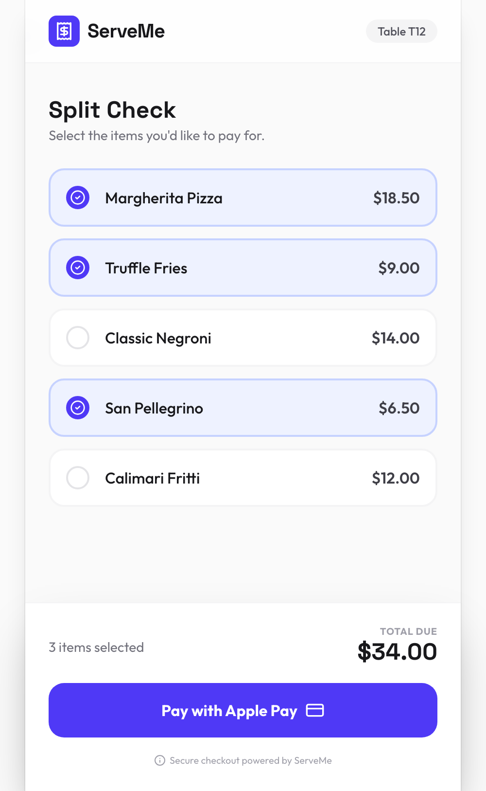

# ServeMe — Split-by-Item Restaurant Checkout

> Scan a QR code, tap the items you ordered, pay your share. No maths, no passing one card around a table of eight.

`TypeScript` · `React` · `Vite`



*Three items selected, $34.00 owed - each diner settles only what they ordered.*

---

## The problem

Splitting a restaurant bill is a solved problem socially and an unsolved one operationally. Evenly-split payment apps get it wrong when one person had a starter and tap water; asking a server to split a bill eight ways by item takes longer than the meal's last course.

ServeMe puts the split on the diner's phone: the table's bill loads from a QR code, each person selects their own items, and everyone pays their own total.

## What it does

- QR-linked table bill
- Per-item selection per diner
- Independent settlement — no single payer fronting the total

## Run locally

**Prerequisites:** Node.js 18+

```bash
npm install
cp .env.example .env.local
npm run dev
```

## Status

**Earliest-stage prototype in this portfolio** — ~440 lines. The interaction model is built; payment provider integration is not.

## License

MIT
